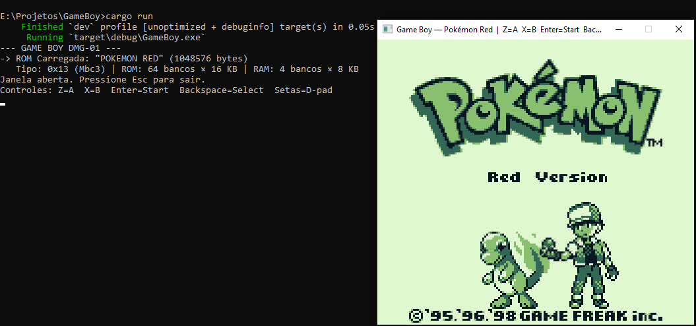
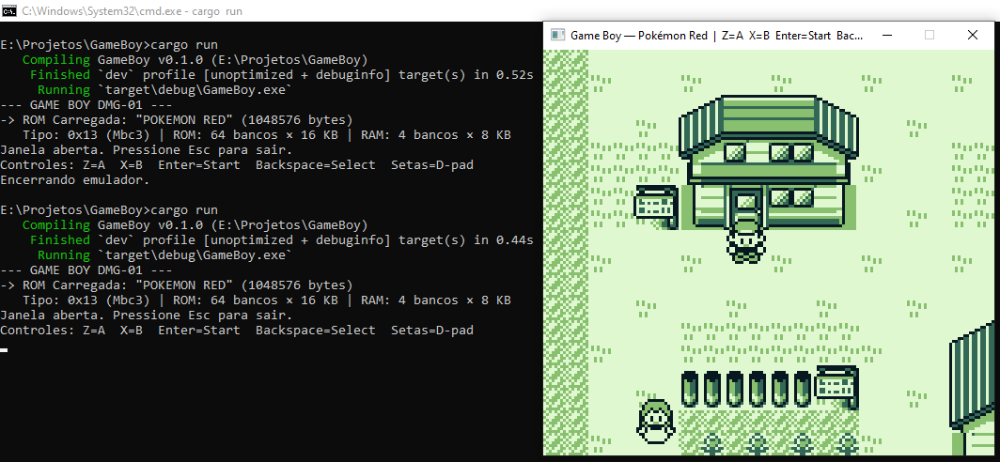
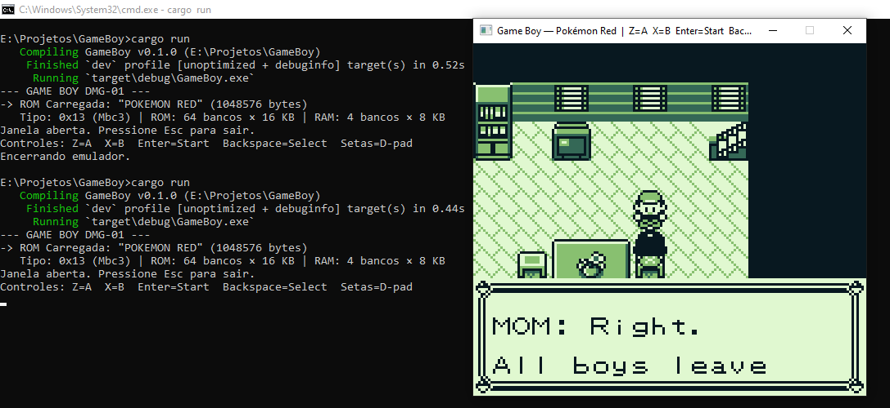
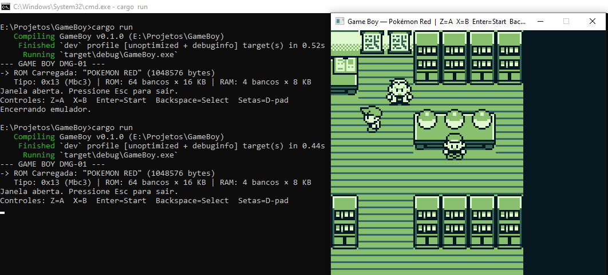
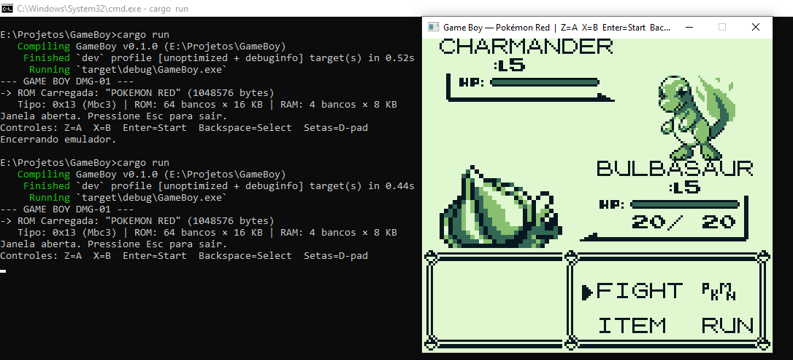
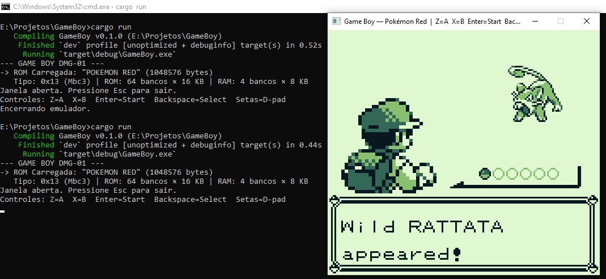

# 🎮 GameBoy DMG-01 Emulator

> **Emulador do Game Boy Classic (DMG-01) escrito do zero em Rust puro.**  
> Capaz de rodar Pokémon Red do início ao fim, com janela em tempo real, paleta original e controles por teclado.

---

## 📸 Screenshots

| Tela de Título | Pallet Town |
|:-:|:-:|
|  |  |

| Diálogo com a Mãe | Pokémon Center |
|:-:|:-:|
|  |  |

| Batalha do Rival | Pokémon Selvagem |
|:-:|:-:|
|  |  |

---

## ⚠️ Aviso Legal

Este projeto é um **emulador de hardware** — um software que replica o comportamento do processador, memória e periféricos do console Nintendo Game Boy (DMG-01), publicado em 1989.

**O emulador em si não contém nenhum jogo, nenhuma ROM, nenhum dado protegido por direitos autorais.**

A ROM utilizada durante o desenvolvimento (`teste.gb`) foi extraída de um cartucho físico original de Pokémon Red de propriedade do autor. O autor **não se responsabiliza** pelo uso deste emulador com ROMs obtidas de forma ilegal. A distribuição de ROMs de jogos comerciais sem autorização do detentor dos direitos é pirataria e é ilegal em grande parte do mundo.

**Use com ROMs que você possui legalmente.**

---

## 🧠 Como funciona — Arquitetura técnica completa

### Visão geral do hardware emulado

O Game Boy DMG-01 é um computador de 8 bits baseado em:

| Componente | Detalhe |
|---|---|
| **CPU** | Sharp SM83 — híbrido entre Intel 8080 e Zilog Z80 |
| **Clock** | 4.194.304 Hz (~4,19 MHz) |
| **RAM interna** | 8 KB (WRAM) + 127 bytes (HRAM) |
| **VRAM** | 8 KB — tiles gráficos e tilemaps |
| **LCD** | 160×144 pixels, 4 tons de verde, 59,73 fps |
| **OAM** | 160 bytes — dados de até 40 sprites |
| **Cartucho** | MBC (Memory Bank Controller) — gerencia ROM/RAM extra |
| **Áudio** | APU com 4 canais (não implementado nesta versão) |

---

### 📁 Estrutura do projeto

```
GameBoy/
├── src/
│   ├── main.rs        — Loop principal, janela minifb, controles
│   ├── cpu.rs         — Processador SM83 (todas as instruções)
│   ├── bus.rs         — Barramento de memória, DMA, Timer, Joypad
│   ├── ppu.rs         — Renderizador gráfico (PPU)
│   └── cartridge.rs   — Leitor de ROM + MBC3
├── Cargo.toml         — Dependências (apenas minifb)
├── teste.gb           — ROM do jogo (não incluída)
└── README.md          — Este arquivo
```

---

### 🔧 Componente 1 — CPU (`cpu.rs`)

O processador Sharp SM83 é o "cérebro" do Game Boy. Implementa:

- **Todos os opcodes de 8 bits** (0x00–0xFF) e o **prefixo CB** (256 instruções adicionais de rotação/bit)
- **Registradores:** A, B, C, D, E, H, L (8 bits cada) + AF, BC, DE, HL (pares de 16 bits) + SP (Stack Pointer) + PC (Program Counter)
- **Flags como struct Rust:** `{ zero, subtract, half_carry, carry }` — evita erros de manipulação de bits
- **Sistema de interrupções:** VBlank, LCD STAT, Timer, Serial, Joypad — via registradores IE (0xFFFF) e IF (0xFF0F)
- **Modo HALT:** CPU para e aguarda interrupção para economizar ciclos
- **`step()` retorna ciclos consumidos** — necessário para sincronizar PPU e Timer

```
Cada instrução consome entre 4 e 24 ciclos de clock.
Um frame completo = 70.224 ciclos = 154 scanlines × 456 ciclos/scanline.
```

---

### 🔧 Componente 2 — Barramento (`bus.rs`)

O barramento conecta todos os componentes ao espaço de endereçamento de 64 KB:

```
0x0000–0x7FFF   ROM do Cartucho  (bancos controlados pelo MBC)
0x8000–0x9FFF   VRAM             (tiles + tilemaps)
0xA000–0xBFFF   RAM do Cartucho  (saves / RTC)
0xC000–0xDFFF   WRAM             (Work RAM interna — 8 KB)
0xE000–0xFDFF   Echo RAM         (espelho de 0xC000–0xDDFF)
0xFE00–0xFE9F   OAM              (dados dos 40 sprites)
0xFF00–0xFF7F   Registradores de I/O
0xFF80–0xFFFE   HRAM             (High RAM — 127 bytes)
0xFFFF          IE               (Interrupt Enable)
```

**Registradores de I/O implementados:**

| Endereço | Nome | Função |
|---|---|---|
| 0xFF00 | JOYPAD | Leitura dos botões (D-pad ou face buttons por seleção de grupo) |
| 0xFF04 | DIV | Divisor de clock (incrementa a 16.384 Hz, reset ao escrever) |
| 0xFF05–07 | TIMA/TMA/TAC | Timer configurável (4 frequências) |
| 0xFF0F | IF | Interrupt Flag — bits de pedido de interrupção |
| 0xFF40–4B | LCDC/STAT/etc | Registradores da PPU |
| **0xFF46** | **OAM DMA** | **Copia 160 bytes da WRAM para OAM — essencial para sprites** |
| 0xFFFF | IE | Interrupt Enable — quais interrupções estão ativas |

**OAM DMA** é o mecanismo mais crítico para sprites: o jogo escreve um byte (ex: `0xC1`) em 0xFF46, e o hardware copia 160 bytes de `0xC100–0xC19F` para o OAM. Isso é feito a cada frame para atualizar as posições de todos os sprites (personagens, inimigos, etc.).

---

### 🔧 Componente 3 — PPU — Renderizador Gráfico (`ppu.rs`)

A PPU (Picture Processing Unit) gera 144 linhas horizontais a 59,73 fps. Opera em **modo scanline** com 4 fases por linha:

```
Modo 2 — OAM Scan   (80 ciclos): seleciona os sprites visíveis na linha
Modo 3 — Drawing    (172 ciclos): renderiza BG + Window + Sprites
Modo 0 — HBlank     (204 ciclos): linha completa, CPU acessa VRAM livremente
(repetido 144 vezes, depois:)
Modo 1 — VBlank     (4.560 ciclos / 10 linhas): frame completo, dispara interrupção
```

**Três camadas renderizadas por scanline:**

1. **Background (BG)** — tilemap 32×32 tiles no espaço 256×256, com scroll `SCX`/`SCY`. Cada tile é 8×8 pixels, 2 bits por pixel (4 tons), dados em 0x8000 ou 0x8800 (endereçamento signed/unsigned via LCDC bit 4)

2. **Window** — segunda camada de tilemap sobreposta na tela (usada para HUD, menus, caixas de diálogo). Posicionada por `WX`/`WY`. Tem contador próprio `window_line` que incrementa a cada scanline onde ela está ativa

3. **Sprites (OBJ)** — lidos do OAM, suporte a 8×8 e 8×16 pixels, flip horizontal/vertical, 2 paletas (OBP0/OBP1), prioridade sobre o BG, máximo de 10 por scanline (limitação do hardware original)

**Paleta DMG-01 clássica (verde):**

| ID | Cor ARGB | Visual |
|---|---|---|
| 0 | `#E0F8D0` | Branco-esverdeado (mais claro) |
| 1 | `#88C070` | Verde claro |
| 2 | `#346856` | Verde escuro |
| 3 | `#081820` | Quase preto |

---

### 🔧 Componente 4 — Cartucho / MBC3 (`cartridge.rs`)

Pokémon Red usa o **MBC3** (Memory Bank Controller 3), que expande os 64 KB de espaço de endereçamento do Game Boy para gerenciar ROMs e RAMs maiores:

- **ROM:** 64 bancos × 16 KB = 1 MB total. O banco 0 é fixo em 0x0000–0x3FFF; o banco ativo (1–63) é mapeado em 0x4000–0x7FFF
- **RAM:** 4 bancos × 8 KB = 32 KB de save RAM
- **RTC stub:** o MBC3 físico inclui um relógio em tempo real (para o sistema de dias em Pokémon). Implementado como stub (não funcional nesta versão)

---

### 🔧 Componente 5 — Janela em Tempo Real (`main.rs`)

A interface usa **minifb** — biblioteca leve de janelas sem dependências externas (sem SDL2, sem OpenGL):

- **Resolução:** 480×432 pixels (escala 3× do LCD original de 160×144)
- **Frame rate:** ~59,73 fps via throttle manual com `std::time::Instant`
- **Upscaling:** cada pixel do Game Boy é replicado em um bloco 3×3 de pixels reais
- **Loop:** `update_joypad → run_frame(70.224 ciclos) → blit_framebuffer → present → sleep`

**Conversão do framebuffer:**
```
[u8; 160×144]  →  blit_framebuffer()  →  [u32; 480×432]
(shade 0–3)                               (ARGB 0x00RRGGBB)
```

---

## ⌨️ Controles

| Tecla | Botão Game Boy |
|---|---|
| **Seta →** | D-pad Direita |
| **Seta ←** | D-pad Esquerda |
| **Seta ↑** | D-pad Cima |
| **Seta ↓** | D-pad Baixo |
| **Z** | Botão A |
| **X** | Botão B |
| **Enter** | Start |
| **Backspace** | Select |
| **Esc** | Sair |

---

## 🚀 Como compilar e rodar

### Pré-requisitos

- [Rust](https://rustup.rs/) (versão estável, qualquer versão recente)
- Windows 10/11 × 64 (testado) — Linux e macOS funcionam também
- Uma ROM `.gb` obtida legalmente (renomeie para `teste.gb`)

### Passo a passo

```bash
# 1. Clone ou baixe o projeto
cd E:\Projetos\GameBoy

# 2. Coloque sua ROM na pasta raiz do projeto com o nome:
#    teste.gb

# 3. Compile e rode (na primeira vez baixa o minifb ~258 KB)
cargo run

# Para build otimizado (mais rápido, sem debug info):
cargo run --release
```

### O que aparece no terminal ao rodar

```
--- GAME BOY DMG-01 ---
-> ROM Carregada: "POKEMON RED" (1048576 bytes)
   Tipo: 0x13 (MBC3) | ROM: 64 bancos x 16 KB | RAM: 4 bancos x 8 KB
Janela aberta. Pressione Esc para sair.
Controles: Z=A  X=B  Enter=Start  Backspace=Select  Setas=D-pad
```

---

## 🗺️ O que está implementado vs. o que falta

### ✅ Implementado e funcionando

- CPU SM83 completa (todos os opcodes, prefixo CB, interrupções, HALT)
- PPU completa (BG, Window, Sprites 8×8 e 8×16, paletas, prioridades)
- OAM DMA (cópia de sprites a cada frame)
- Timer completo (DIV, TIMA, TMA, TAC com 4 frequências)
- Joypad com seleção de grupo (D-pad / botões)
- MBC3 completo (64 bancos de ROM, 4 bancos de RAM, RTC stub)
- Janela em tempo real (minifb, 3×, ~60 fps)
- Paleta DMG-01 clássica verde

### 🔲 Não implementado (possíveis melhorias futuras)

| Feature | Impacto | Dificuldade |
|---|---|---|
| **APU** (áudio) | Roda em silêncio | Alta — 4 canais de síntese |
| **Save para .sav** | Progresso perdido ao fechar | Baixa — serializar RAM para arquivo |
| **MBC3 RTC real** | Sistema de dias não funciona | Média |
| **Sprite X-priority** | Artefato visual raro | Baixa |
| **DMG boot ROM** | Pula animação do logo Nintendo | Baixa |
| **MBC1/MBC2/MBC5** | Outros jogos GB | Média — adicionar mappers |
| **Game Boy Color** | ROMs GBC não rodam | Alta — PPU, paletas, DMA duplo |

---

## 🧪 Compatibilidade testada

| Jogo | Status |
|---|---|
| Pokémon Red | ✅ Jogável do início ao fim |
| Pokémon Blue | ✅ Compatível (mesmo mapper MBC3) |
| Outros jogos MBC3 | ✓ Devem funcionar |
| Jogos MBC1 (Tetris, etc.) | ⚠️ Não testado |

---

## 🏗️ Tecnologias

- **Linguagem:** [Rust](https://www.rust-lang.org/) — segurança de memória, performance nativa
- **Janela:** [minifb 0.27](https://github.com/emoon/rust_minifb) — única dependência externa
- **Sem SDL2, sem OpenGL, sem frameworks pesados**

---

## 📖 Referências técnicas usadas no desenvolvimento

- [Pan Docs](https://gbdev.io/pandocs/) — documentação técnica completa do DMG-01
- [Game Boy CPU Manual](http://marc.rawer.de/Gameboy/Docs/GBCPUman.pdf) — referência do SM83
- [The Ultimate Game Boy Talk (CCC)](https://www.youtube.com/watch?v=HyzD8pNlpwI) — arquitetura geral

---

*Emulador desenvolvido com fins educacionais. Todo o código é original, escrito do zero.*
